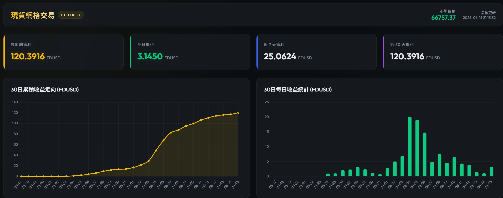

# BTC/FDUSD 現貨網格交易機器人

這是一個基於幣安 (Binance) Spot API 與 WebSocket Streams 開發的 BTC/FDUSD 現貨網格交易系統。系統採用 WebSocket 訂閱即時行情，並具備 Rest API 自動重連與自癒機制，同時附帶一個簡易的網頁版監控 Dashboard。



## 🌟 核心特色
* **即時價格監聽**：透過 WebSocket Streams 取得即時市場行情。
* **半開/死連線檢測**：加入 120 秒超時心跳檢測機制，自動斷線重連。
* **Rest API 備援自癒**：當 WebSocket 斷訊時，定時同步任務會自動退回使用 Rest API 撈取最新價格，防止以過期價格同步網格導致掛單錯誤。
* **局部同步優化**：僅針對靠近現價的格點進行 Rest 同步，大幅降低幣安 API 權重消耗。
* **交易 Dashboard**：提供簡易的後端伺服器與 HTML 監控介面，方便即時查看累計利潤、網格分佈與近期成交明細。

---

## 📂 專案結構
```text
現貨網格/
├── .env.example        # 環境變數設定範本 (API 金鑰)
├── .gitignore          # Git 忽略設定檔案 (已防範金鑰及資料庫外洩)
├── config.py           # 網格間距、單筆金額、精度等系統設定
├── db.py               # SQLite 資料庫操作模組 (記錄網格與利潤)
├── grid_bot.py         # 網格交易核心主程式 (包含 Webhook 接收與自癒)
├── requirements.txt    # 專案依賴 Python 套件
├── run_bot.bat         # Windows 一鍵啟動指令檔
├── test_grid.py        # 網格邊界與計算邏輯測試檔
└── web/
    ├── index.html      # 監控 Dashboard 前端網頁
    └── server.py       # 監控 Dashboard 後端 HTTP 伺服器
```

---

## 🛠️ 安裝與設定說明

> [!NOTE]
> 如果您還沒有幣安 (Binance) 帳戶，歡迎使用邀請碼 **`CLICK168`** 註冊以享有手續費優惠，或直接點擊 [幣安推薦註冊連結](https://accounts.binance.com/register?ref=CLICK168) 進行註冊。

### 1. 準備環境
本專案建議使用 Python 3.10+。請於專案目錄下建立並啟用虛擬環境（建議使用 `uv` 或 `venv`）：
```bash
# 建立虛擬環境
python -m venv .venv

# 啟用虛擬環境 (Windows)
.venv\Scripts\activate
```

### 2. 安裝套件
啟用虛擬環境後，使用下方指令安裝專案所需的 Python 依賴：
```bash
pip install -r requirements.txt
```

### 3. 配置 API 金鑰（⚠️ 重要安全步驟）
1. 複製專案目錄下的 `.env.example` 並重新命名為 `.env`：
   ```bash
   cp .env.example .env
   ```
2. 開啟 `.env` 檔案，填入您在幣安申請的 API 金鑰：
   ```ini
   BINANCE_API_KEY=您的幣安API金鑰
   BINANCE_API_SECRET=您的幣安API私鑰
   ```
   > [!IMPORTANT]
   > **請絕對不要將 `.env` 檔案提交到公開的 Git 倉庫！** 專案的 `.gitignore` 檔案已預設將其排除，請務必保持其排除狀態以維護您的帳戶資產安全。

---

## 🚀 啟動與使用

### 啟動網格機器人
在 Windows 上，您可以直接點擊或執行 `run_bot.bat`；在命令列中則執行：
```bash
python grid_bot.py
```

### 啟動監控 Dashboard
欲開啟網頁版 Dashboard 監控目前的網格運行狀態：
1. 啟動後端伺服器：
   ```bash
   python web/server.py
   ```
2. 使用瀏覽器開啟：[http://localhost:5000](http://localhost:5000) 即可查看即時的收益與網格狀態。

---

## 🔒 安全性宣告
* **金鑰保護**：所有的敏感 API 憑證皆讀取自本地的 `.env`。`.gitignore` 檔案中已設定忽略 `.env`、`*.db`（SQLite 庫檔案）以及 `log/`（日誌資料夾）。
* **無公開風險**：請不要修改 `.gitignore` 中關於安全部分的設定，以防將實盤交易的資料庫或金鑰推送到 GitHub。
